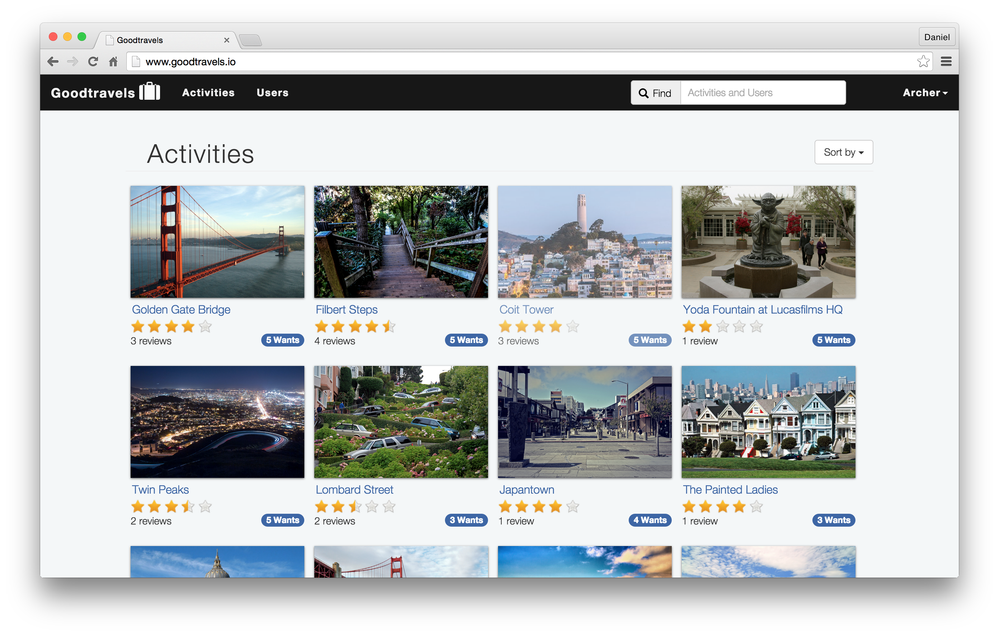
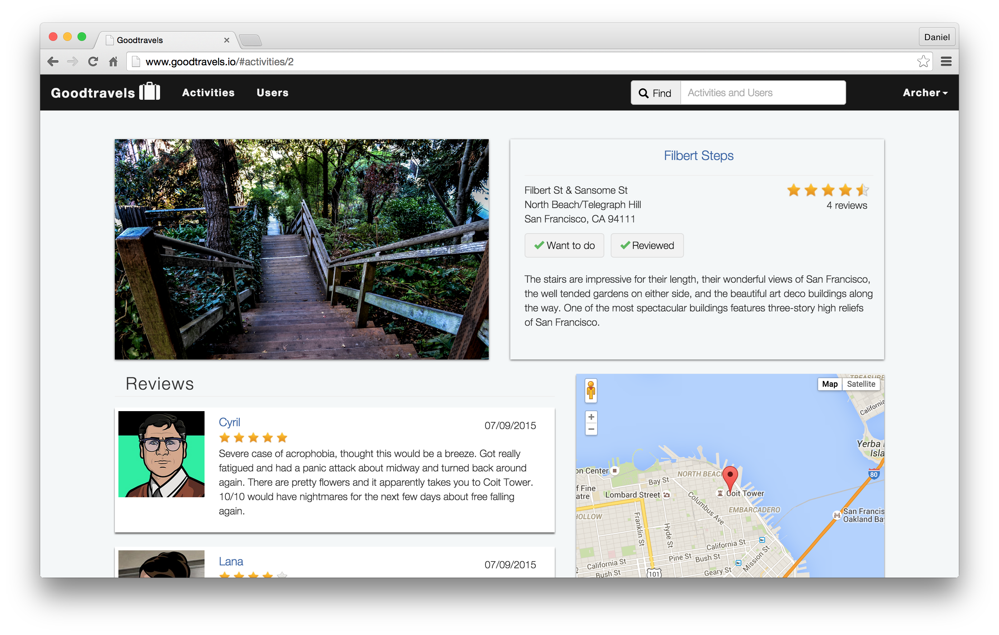
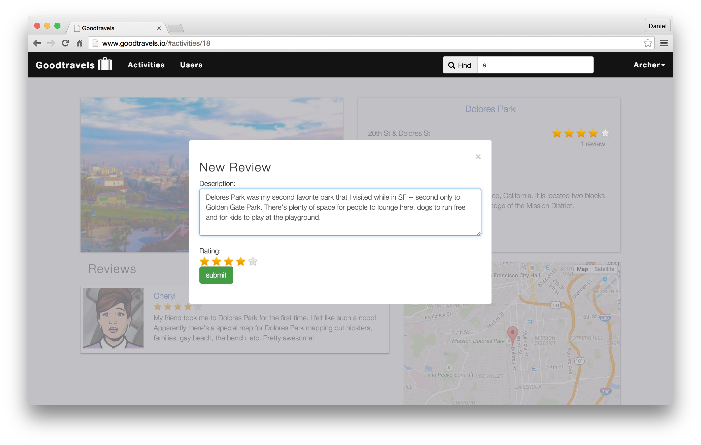
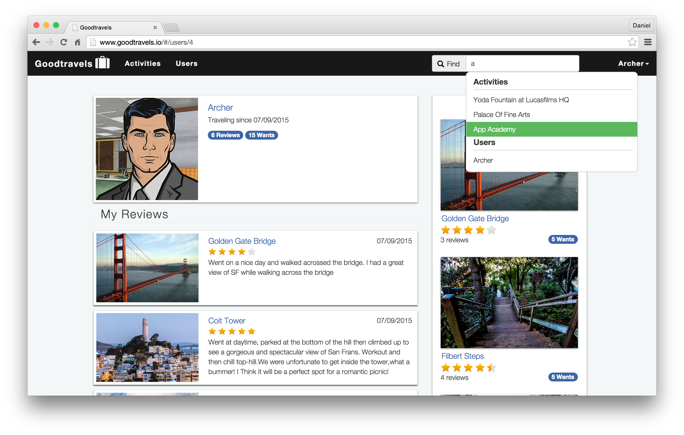

# Goodtravels

Live Link: [www.goodtravels.io](http://www.goodtravels.io/)

#### View Activities

## Feature Highlights
* Users can save activities to a personal "Want To Do" collection [[source]](https://github.com/danielng09/Goodtravels/blob/master/app/assets/javascripts/views/activities/showDetails.js)
* Users rate an activity by sliding up and down a scale in half star increments. [[source]](https://github.com/danielng09/Goodtravels/blob/master/app/assets/javascripts/views/reviews/form.js)
* Search bar suggests activities and users in real time as you type [[source]](https://github.com/danielng09/Goodtravels/blob/master/app/assets/javascripts/views/search/search.js)
* Activities are sortable by reviews, ratings, and wants [[source]](https://github.com/danielng09/Goodtravels/blob/master/app/assets/javascripts/views/activities/index.js)

## Minimum Viable Product
Goodtravels is built on Rails and Backbone and is inspired by Goodreads. Users review
travel related content and can:

<!-- This is a Markdown checklist. Use it to keep track of your progress! -->

- [x] Create accounts
- [x] Log in
- [x] View list of activities
- [x] View reviews on an activity
- [x] View average rating and number of reviews
- [x] Write review for activity
- [x] Give rating to activity
- [x] View list of activities reviewed
- [x] Bookmark activity
- [x] View list of bookmarked activities
- [x] Search for activity by name

## Design Docs
* [DB schema][schema]

[schema]: ./docs/schema.md

## Implementation Timeline

### Phase 1: User Authentication and Activity Views (~1 day)
I will use Rails to implement user authentication and log in. By the end of
this phase, users will be able to access two views - a list of all activities
and show page for a specific activity. The most important part of this phase
will be pushing the app to Heroku and ensuring that everything works before
moving on to phase 2.

[Details][phase-one]

### Phase 2: Viewing Activities and Creating Reviews (~2 days)
I will add API routes to serve activity and review data as JSON, then add Backbone
models and collections that fetch data from those routes. By the end of this
phase, users will be able to view activities as well as rate and review
those activities within a single Backbone app.

[Details][phase-two]

### Phase 3: Searching for Activities (~1 days)
I will add a search function for activities. Users should be able to search for
activities by name.

[Details][phase-three]

### Phase 4: User Views (~2 days)
I will add a user API route to serve JSON data for users. Then I will add a
Backbone model and collection to fetch data from the API point. Users should be
able to view an index of all users as well as view specific profiles of each user.

[Details][phase-four]

### Phase 5: Sorting Activities and Users (~1-2 days)
I will enable users to view activities by selecting filters. Filters will include
their list of bookmarked activities, activities they have reviewed, top rated
activities, and most popular activities.

[Details][phase-five]

### Bonus Features (TBD)
- [x] User avatars
- [x] View another user's saved "Want To Do" activities
- [x] Modal view when creating new review
- [x] Google map with pins for activity location
- [x] Typeahead search bar
- [ ] Create new activities
- [ ] Upload photos onto activity page
- [ ] Carousel feature for images in activity detail
- [ ] Pagination/infinite scroll
- [ ] Allow friend association between users
- [ ] User can comment on another user's review
- [ ] Feed of friend reviews
- [ ] Group and search activities by categories
- [ ] Display closest activities
- [ ] User receives suggested activity based on preferences filter

[phase-one]: ./docs/phases/phase1.md
[phase-two]: ./docs/phases/phase2.md
[phase-three]: ./docs/phases/phase3.md
[phase-four]: ./docs/phases/phase4.md
[phase-five]: ./docs/phases/phase5.md
